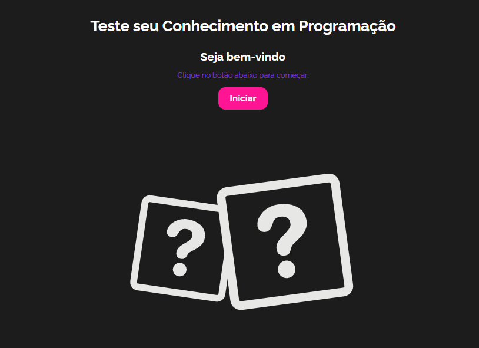
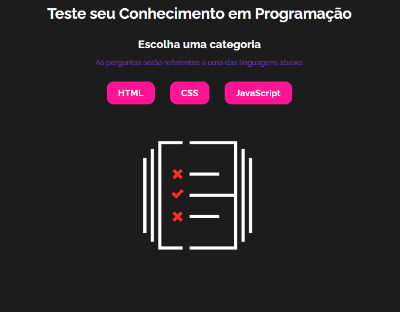
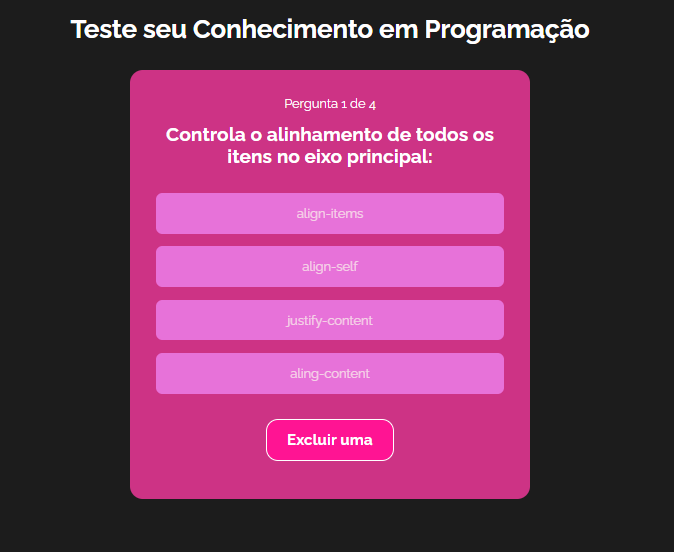
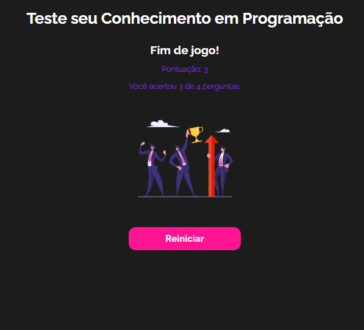

#### Projeto React
#### Projeto de Quiz com os recursos fundamentais de React.js: componentização, Context API, hooks...
#### Todos os itens citados acima são fundamentais para qualquer programador front-end que utilize React

<a href="#" target="_blank">Link Projeto</a>

[]
[]
[]
[]